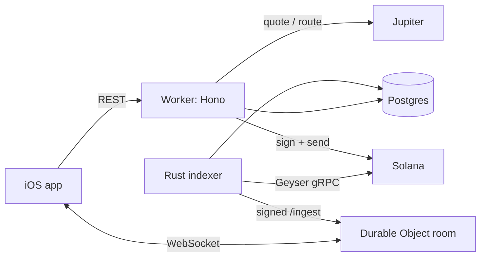

# stonks247-be

Backend for **Stonks247** — tokenized equities on Solana, traded from an iOS app.

Hono on Cloudflare Workers. Reads the Postgres that [the indexer](https://github.com/ape-me/ape-indexer)
writes, over Hyperdrive, and pushes live trades to phones over Durable Object WebSocket rooms.

---

## What it does

Users hold a Privy embedded wallet and trade tokenized stocks — `NVDAX`, `METAX`, and a set of
pre-IPO names like `OPENAI` and `ANTHROPIC` — against USDC through Jupiter. The interesting part is
that **users never need SOL**. They sign; we pay the network.



---

## Three problems worth reading the code for

**Gas sponsorship.** Jupiter builds every order transaction with the maker as fee payer, and our
makers hold no SOL. [`gasPays()`](src/lib/solana.ts) decompiles the V0 message, moves our gas wallet
into slot 0, remaps every account index, and re-signs — so the user signs a transaction they don't
pay for. Any token account opened along the way is billed to us too.

**Limit orders that fill where the user set them.** Jupiter takes its fee from the order's *output*
mint and sources it *on top* of the taking amount. Sizing an order at the full gross means it only
fills once the price clears the trigger by the fee as well — a $5.44 trigger that really needed
$5.4949. [`quoteOrder()`](src/services/orders.ts) sizes net of the fee instead, so the number the
user types is the price they get.

**Rebasing stock tokens.** Token-2022 `scaledUiAmountConfig` means raw balances don't equal share
counts; a multiplier moves under you after splits and dividends. Every conversion goes through both
`decimals` and `multiplier`, and prices are always per *displayed* unit.

---

## Layout

```
src/contract.ts   every boundary shape, zod          → the only place a payload is defined
src/repos/        SQL, and nothing else
src/services/     business logic, shaping, caching
src/routes/       HTTP, and nothing else
src/do/room.ts    WebSocket fan-out
src/middleware/   auth, CORS, rate limits
```

No business logic in routes, no SQL outside repos, all input parsed through `lib/validate.ts`.

---

## Running it

```bash
bun install
cp .dev.vars.example .dev.vars   # fill in
bun run dev
```

```bash
bun run check    # tsc --noUnusedLocals, oxlint, prettier @ 110 cols
bun run deploy
```

`bun run check` gates every commit.

---

## Stock overrides

Hide, re-categorise or tag a stock without a deploy. The API picks it up immediately; the indexer
re-reads `stock_config` on its 10-minute list sync and subscribes or unsubscribes accordingly.

```bash
# ADMIN_TOKEN is a Worker secret; locally it lives in .admin_token (gitignored)
export TOKEN=$(cat .admin_token)
export API=https://apme-be.iamjoey.workers.dev/v1/admin

# list every stock, excluded ones first
curl -sH "Authorization: Bearer $TOKEN" $API/stocks

# hide one
curl -sH "Authorization: Bearer $TOKEN" -H 'content-type: application/json' \
  -X POST $API/stocks/<mint> \
  -d '{"excluded": true, "note": "non-PreStocks pre-IPO"}'
```

| Field      | Type                                | Meaning                          |
| ---------- | ----------------------------------- | -------------------------------- |
| `excluded` | `bool`                              | Hide from the app and stop indexing |
| `category` | `preipo \| stock \| etf \| crypto`  | Asset class, `null` to clear     |
| `tags`     | `string[]`                          | Collection ids the stock appears in |
| `note`     | `string`                            | Why — for whoever reads this next |

---

## Runtime config

Values in `app_config` are read live, so behaviour changes without a deploy.

| Key                   | Default | Effect                                              |
| --------------------- | ------- | --------------------------------------------------- |
| `orders.min_usd`      | `5`     | Smallest limit order                                |
| `orders.min_gap_bps`  | `0`     | How far a trigger must sit from spot                |
| `orders.ttl_days`     | `0`     | Order lifetime; `0` means orders rest until cancelled |

---

## Notes

- **Fees.** 1% on trades, taken from the output mint. Some issuers bake a transfer fee into the mint
  itself — currently 3% on every PreStocks name, 0% elsewhere. Jupiter's trigger protocol refuses
  any mint carrying one, so those names are market-only.
- **Non-custodial.** Keys live with Privy under the user's control. This backend can build and
  sponsor a transaction; it cannot move anyone's funds.
- **The apelist** (email waitlist) is separate: D1, `migrations/d1`, routes in `src/routes/apelist.ts`.
  `scripts/blast.ts` sends the launch email and is never run automatically.
